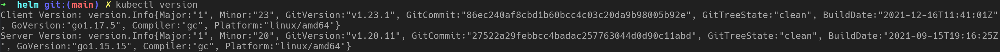
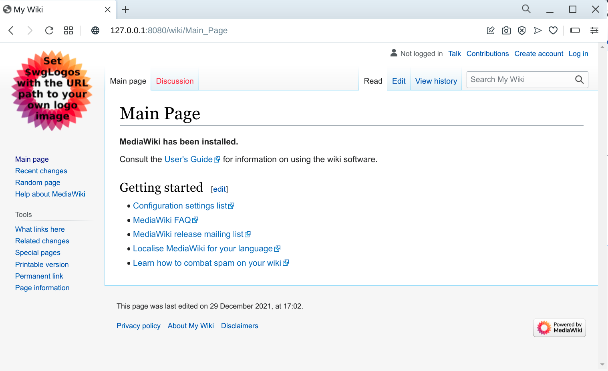
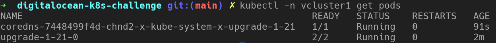
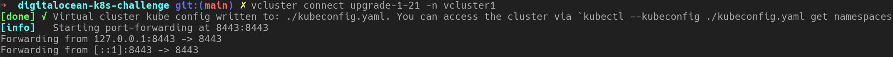
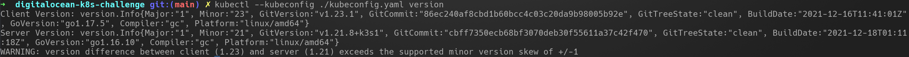
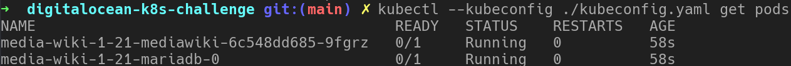
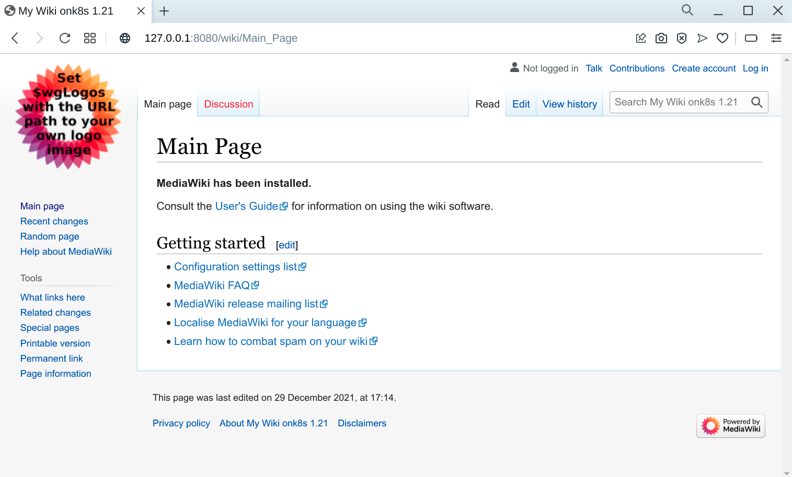

# Using Loft vcluster's for in cluster upgrade testing

> This write-up was produced during the [DigitalOcean Kubernetes Challenge](https://www.digitalocean.com/community/pages/kubernetes-challenge)

This walkthrough will show you how to provide an in cluster quality/test-system for Kubernetes upgrades using Loft's vcluster.

## Checking version of hosting Cluster

First we will check the version of our hosting cluster to show that is running a different version than the later-on deployed cluster:



## Deploy an Application

To have something to test we need an application in our cluster. Later on we want to make sure that this application still continues to work on a newer version of Kubernetes.

The following steps will install a working MediaWiki installation including a MariaDB database. We'll use the `bitnami/mediawiki` Helm chart for the installation from the great guys over at Bitnami.

```
# add the necessary Helm repo
helm repo add bitnami https://charts.bitnami.com/bitnami

# install your MediaWiki instance as 'media-wiki-1-20' using the Helm values provided in this repo
helm install media-wiki-1-20 bitnami/mediawiki -f helm/mediawiki-values.yaml

# create a port forwarding to your MediaWiki instance
kubectl port-forward --namespace default svc/media-wiki-1-20-mediawiki 8080:80
```

You should now be able to visit your newly created MediaWiki instance as you point your browser to [http://127.0.0.1:8080](http://127.0.0.1:8080)



> As this guide focuses on using vclusters for Kubernetes upgrade tests we will not bother with properly exposing the MediaWiki instance to the public and just run in as an Kubernetes internal service

## Spinning up your vcluster

The following steps will guide you through the setup of a Loft vcluster running on the same cluster as your MediaWiki instance does. We will select the matching Kubernetes version for the vcluster that corresponds to the target version you want to update the hosting Kubernetes cluster to.

1. Install vcluster CLI: [link](https://www.vcluster.com/docs/getting-started/setup#download-vcluster-cli)
2. Create a new vcluster matching the Kubernetes version you want to upgrade to. As vcluster use k3s (a lightweight Kubernetes from Rancher) to spin up its control plane you can check the available k3s version on [Docker Hub](https://hub.docker.com/r/rancher/k3s/tags) or the [k3s GitHub Repo](https://github.com/k3s-io/k3s/releases) to select a version that matches the planned version for your upgrade.
```
vcluster create upgrade-1-21 -n vcluster1 --k3s-image rancher/k3s:v1.21.8-k3s1
```
3. Check that vcluster pods are running on the hosting cluster:
```
kubectl -n vcluster1 get pods
```

4. Open a tunnel to vcluster API server to access Kubernetes API the testing cluster. With this step the vcluster CLI will forward a local machine port to the api-server of your newly created vcluster an drop a matching kube-config to the local directory.
```
vcluster connect upgrade-1-21 -n vcluster1
```

The Kubernetes config file gets written to the current directory named `./kubeconfig.yaml`.
Leave the current terminal containing the tunneling process running and open another one to access the testing cluster via the tunnel and the new Kubernetes config file.
5. Access vcluster via kubectl
```
kubectl --kubeconfig ./kubeconfig.yaml version
```


Now we have a new vcluster running version v1.21 deployed on our hosting cluster that still runs v1.20.

## Deploy our Application to the vcluster

Next up we will deploy a separate instance using the exact same configuration as before to the vcluster running the updated version. This way we can make sure that our application plays nicely with the new Kubernetes version.

1. Deploy a separate MediaWiki instance to the vcluster. Make sure to use the newly generated `kubeconfig.yaml`. We will name the release `media-wiki-1-21` for an easy separation from the previous instance and also change the `mediawikiName` to make the instances distinguishable from the browser. 
```
helm install --kubeconfig ./kubeconfig.yaml media-wiki-1-21 bitnami/mediawiki -f helm/mediawiki-values.yaml --set mediawikiName="My Wiki on k8s 1.21"
```
2. Check and wait until all MediaWiki pods are running
```
kubectl --kubeconfig ./kubeconfig.yaml get pods
```


3. Create a port-forwarding to access the newly created MediaWiki instance
```
kubectl --kubeconfig ./kubeconfig.yaml port-forward --namespace default svc/media-wiki-1-21-mediawiki 8888:80
```

After pointing your browser to the newly forwarded localhost port you can see the MediaWiki version running in the vcluster and displaying the updated name in the browser tab `My Wiki on k8s 1.21`:



## Teardown and Kubernetes Upgrade

After this successfull test of our application with the new Kubernetes version we are now ready to teardown the internal testing vcluster and proceed with the upgrade from the actual hosting cluster.

```
vcluster delete upgrade-1-21 --namespace vcluster1
```

Now you can upgrade your DigitalOcean cluster without any worries.
